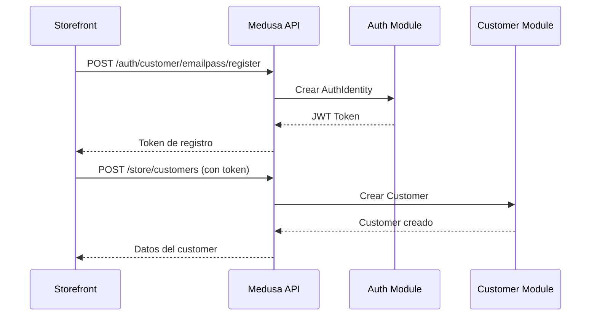
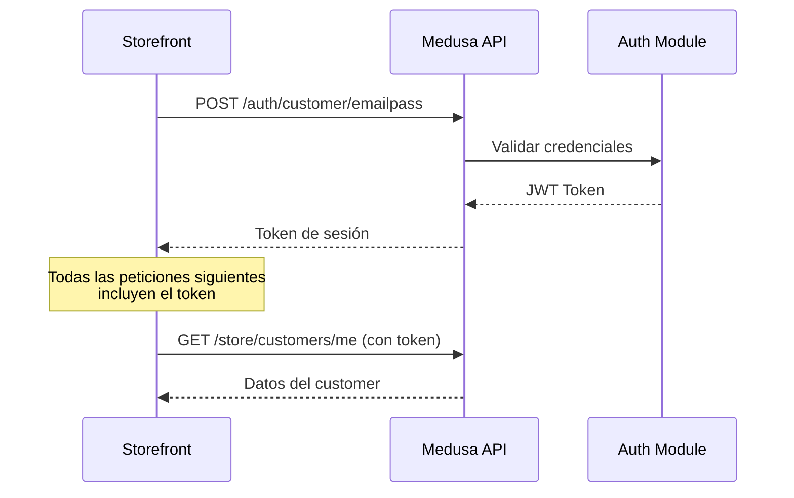

# Guía de Autenticación: Usuarios vs Clientes en Medusa.js

## Resumen Ejecutivo

En Medusa.js, existe una **separación clara y segura** entre usuarios administrativos (admins) y clientes (customers). Esta guía explica cómo implementar correctamente la autenticación para ambos tipos de actores, asegurando que el login del storefront no se asocie con el admin por razones de seguridad.

## Conceptos Fundamentales

### 1. Actor Types (Tipos de Actor)

Medusa utiliza el concepto de **"Actor Types"** para diferenciar tipos de usuarios:

- **`user`**: Usuarios administrativos que acceden al panel de administración
- **`customer`**: Clientes que compran en el storefront
- **Custom actor types**: Puedes crear tipos personalizados (e.g., `manager`, `vendor`)

### 2. Auth Identity

Cada vez que un usuario se registra con un proveedor de autenticación, se crea un registro de `AuthIdentity`. Esta identidad:

- Es independiente para cada actor type
- Almacena credenciales de autenticación
- Vincula al usuario mediante `app_metadata`:

```json
{
  "app_metadata": {
    "customer_id": "cus_123"  // o "user_id" para admins
  }
}
```

### 3. Separación Automática por Rutas

Medusa separa automáticamente la autenticación mediante:

**Para Admins:**
```
POST /auth/user/emailpass         → Login admin
POST /auth/user/emailpass/register → Registro admin
```

**Para Customers:**
```
POST /auth/customer/emailpass         → Login customer
POST /auth/customer/emailpass/register → Registro customer
```

## Implementación en el Storefront

### 1. Registro de Clientes

```typescript
// Ejemplo usando Medusa JS SDK
import { sdk } from "@/lib/sdk"
import { FetchError } from "@medusajs/js-sdk"

export async function registerCustomer(email: string, password: string, firstName: string, lastName: string) {
  try {
    // Paso 1: Obtener token de registro
    await sdk.auth.register("customer", "emailpass", {
      email,
      password,
    })
  } catch (error) {
    const fetchError = error as FetchError
    
    // Manejar caso de email existente
    if (fetchError.message === "Identity with email already exists") {
      // Intentar login si el usuario ya existe
      const loginResponse = await sdk.auth.login("customer", "emailpass", {
        email,
        password,
      })
      
      if (typeof loginResponse !== "string") {
        throw new Error("Authentication requires more actions")
      }
    } else {
      throw error
    }
  }

  // Paso 2: Crear el customer
  const { customer } = await sdk.store.customer.create({
    first_name: firstName,
    last_name: lastName,
    email,
  })

  return customer
}
```

### 2. Login de Clientes

```typescript
export async function loginCustomer(email: string, password: string) {
  // Autenticar usando el actor type "customer"
  const token = await sdk.auth.login("customer", "emailpass", {
    email,
    password,
  })

  if (typeof token !== "string") {
    throw new Error("Authentication requires more actions")
  }

  // Todas las siguientes peticiones estarán autenticadas
  const { customer } = await sdk.store.customer.retrieve()
  
  return customer
}
```

### 3. Configuración del SDK

**Para JWT (Recomendado para React Native, Mobile Apps):**

```typescript
import { Medusa } from "@medusajs/js-sdk"

export const sdk = new Medusa({
  baseUrl: process.env.NEXT_PUBLIC_MEDUSA_BACKEND_URL,
  auth: {
    type: "jwt", // Token almacenado en localStorage por defecto
  },
})
```

**Para Session (Recomendado para Next.js, Web Apps):**

```typescript
export const sdk = new Medusa({
  baseUrl: process.env.NEXT_PUBLIC_MEDUSA_BACKEND_URL,
  auth: {
    type: "session", // Usa cookies HTTP-only
  },
})
```

### 4. Protección de Rutas en el Backend

```typescript
// src/api/middlewares.ts
import { defineMiddlewares, authenticate } from "@medusajs/framework/http"

export default defineMiddlewares({
  routes: [
    {
      matcher: "/custom/admin*",
      middlewares: [
        // Solo usuarios admin pueden acceder
        authenticate("user", ["session", "bearer", "api-key"]),
      ],
    },
    {
      matcher: "/custom/customer*",
      middlewares: [
        // Solo customers pueden acceder
        authenticate("customer", ["session", "bearer"]),
      ],
    },
  ],
})
```

## Flujo de Autenticación Completo

### Flujo para Registro de Cliente:



### Flujo para Login de Cliente:



## Mejores Prácticas de Seguridad

### 1. Separación de Dominios

✅ **Recomendado:**
```
- Admin: admin.tutienda.com → Actor type: "user"
- Storefront: www.tutienda.com → Actor type: "customer"
```

### 2. Métodos de Autenticación

| Contexto | Método Recomendado | Razón |
|----------|-------------------|--------|
| Web App (Next.js) | Session (cookies) | Más seguro, HTTP-only cookies |
| Mobile App (React Native) | JWT | localStorage no disponible |
| Server-to-Server | API Key | Para integraciones backend |

### 3. Almacenamiento de Tokens

**❌ NO HACER:**
```typescript
// Nunca expongas tokens en el cliente
localStorage.setItem('admin_token', token) // MAL
```

**✅ HACER:**
```typescript
// Usa cookies HTTP-only para web
auth: {
  type: "session",
}

// O almacenamiento seguro en mobile
import * as SecureStore from 'expo-secure-store'

auth: {
  type: "jwt",
  jwtTokenStorageMethod: {
    get: async () => await SecureStore.getItemAsync('jwt_token'),
    set: async (token) => await SecureStore.setItemAsync('jwt_token', token),
    remove: async () => await SecureStore.deleteItemAsync('jwt_token'),
  }
}
```

### 4. Protección de Rutas API

```typescript
// src/api/store/customer/orders/route.ts
import type { MedusaRequest, MedusaResponse } from "@medusajs/framework/http"

export async function GET(req: MedusaRequest, res: MedusaResponse) {
  // El middleware authenticate ya verificó que sea un customer
  const customerId = req.auth_context.actor_id
  
  // Solo puede ver sus propias órdenes
  const orders = await orderService.list({
    customer_id: customerId
  })
  
  res.json({ orders })
}
```

## Casos de Uso Especiales

### 1. Admin que También es Customer

Es posible que un usuario admin también tenga una cuenta de customer:

```typescript
// Un admin con email "admin@tienda.com" puede:
// 1. Login como admin
await sdk.auth.login("user", "emailpass", {
  email: "admin@tienda.com",
  password: "admin_password"
})

// 2. Login como customer (misma persona, contexto diferente)
await sdk.auth.login("customer", "emailpass", {
  email: "admin@tienda.com", 
  password: "customer_password"
})
```

### 2. Login Social (Google, GitHub)

```typescript
// Para customers
const loginUrl = await sdk.auth.login("customer", "google", {
  callback_url: "https://tutienda.com/auth/callback"
})

// Redirigir a loginUrl.location
window.location.href = loginUrl.location

// Después del callback
const token = await sdk.auth.callback("customer", "google", {
  code: searchParams.get('code'),
  state: searchParams.get('state')
})
```

### 3. Actor Types Personalizados

Si necesitas un tipo de usuario adicional (e.g., vendedores en un marketplace):

```typescript
// Crear custom actor type en tu módulo
// src/modules/vendor/index.ts

export default defineLink(
  {
    linkable: "vendor",
    actor: "vendor", // Define el actor type
  },
  async (container) => {
    // Tu lógica de módulo
  }
)

// Ahora puedes autenticar vendors
await sdk.auth.login("vendor", "emailpass", {
  email: "vendor@example.com",
  password: "password"
})
```

## Resumen de Endpoints

### Endpoints de Customer (Storefront)

```bash
# Registro
POST /auth/customer/emailpass/register
Body: { "email": "...", "password": "..." }
Response: { "token": "..." }

# Login
POST /auth/customer/emailpass
Body: { "email": "...", "password": "..." }
Response: { "token": "..." }

# Crear customer
POST /store/customers
Headers: { "Authorization": "Bearer {token}" }
Body: { "first_name": "...", "last_name": "...", "email": "..." }

# Obtener customer actual
GET /store/customers/me
Headers: { "Authorization": "Bearer {token}" }

# Reset password
POST /auth/customer/emailpass/reset-password
Body: { "identifier": "email@example.com" }

POST /auth/customer/emailpass/update
Headers: { "Authorization": "Bearer {reset_token}" }
Body: { "email": "...", "password": "new_password" }
```

### Endpoints de Admin

```bash
# Login admin
POST /auth/user/emailpass
Body: { "email": "admin@...", "password": "..." }

# Estos endpoints están en /admin/* y requieren actor type "user"
GET /admin/customers
GET /admin/products
# etc.
```

## Diferencias Clave: Admin vs Customer

| Aspecto | Admin (user) | Customer (customer) |
|---------|--------------|---------------------|
| **Actor Type** | `"user"` | `"customer"` |
| **Rutas de Auth** | `/auth/user/*` | `/auth/customer/*` |
| **Rutas de API** | `/admin/*` | `/store/*` |
| **Módulo** | User Module | Customer Module |
| **Propósito** | Gestión de tienda | Compras en storefront |
| **Permisos** | Acceso completo al admin | Solo sus propios datos |

## Checklist de Implementación

- [ ] Configurar SDK con el método de auth correcto (JWT o Session)
- [ ] Implementar registro usando actor type `"customer"`
- [ ] Implementar login usando actor type `"customer"`
- [ ] Manejar errores de identidad existente
- [ ] Proteger rutas de API con middleware `authenticate("customer", ...)`
- [ ] Implementar logout correctamente
- [ ] Configurar reset de password para customers
- [ ] Separar dominios/rutas de admin y storefront
- [ ] Usar cookies HTTP-only para web o almacenamiento seguro para mobile
- [ ] Probar que admins NO pueden usar tokens de customer y viceversa

## Recursos Adicionales

- [Medusa Docs: Login Customer](https://docs.medusajs.com/resources/storefront-development/customers/login)
- [Medusa Docs: Register Customer](https://docs.medusajs.com/resources/storefront-development/customers/register)
- [Medusa Docs: Auth Module](https://docs.medusajs.com/resources/commerce-modules/auth)
- [Medusa Docs: Auth Identity and Actor Types](https://docs.medusajs.com/resources/commerce-modules/auth/auth-identity-and-actor-types)
- [Medusa Docs: Authentication Routes](https://docs.medusajs.com/resources/commerce-modules/auth/authentication-route)
- [Medusa Docs: Customer Module](https://docs.medusajs.com/resources/commerce-modules/customer)

## Conclusión

La arquitectura de Medusa.js proporciona una **separación nativa y segura** entre usuarios administrativos y clientes mediante:

1. **Actor Types diferentes**: `"user"` vs `"customer"`
2. **Rutas de autenticación separadas**: `/auth/user/*` vs `/auth/customer/*`
3. **APIs segregadas**: `/admin/*` vs `/store/*`
4. **Identidades independientes**: Cada actor type tiene su propia AuthIdentity

Esta separación garantiza que:
- ✅ Los customers nunca pueden acceder a rutas de admin
- ✅ Los admins pueden tener una cuenta de customer separada si lo desean
- ✅ Los tokens no son intercambiables entre actor types
- ✅ La seguridad está garantizada a nivel de arquitectura
