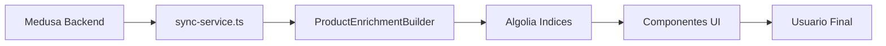

# 🔍 Guía de Algolia para EFE Storefront

## ✅ Estado Actual

✅ **Algolia ya está integrado y funcional** - El proyecto incluye una implementación completa de Algolia para búsqueda y filtrado de productos.

## 🗂 Estructura del Proyecto

### 📁 Archivos Principales de Algolia

```
lib/algolia/
├── index.ts           # Funciones principales (getProduct, getProducts, etc.)
├── client.ts          # Cliente de Algolia con validaciones
├── sync-service.ts    # Sincronización Medusa → Algolia
├── rate-limited.ts    # Funciones con rate limiting para producción
├── filter-builder.ts  # Constructor de filtros para búsquedas
├── config.ts          # Validaciones y configuración
└── utils.ts           # Utilidades auxiliares
```

### 🔄 Flujo de Datos



## 🚀 Configuración Rápida

### 1. Copiar Variables de Entorno

```bash
cp .env.example .env.local
```

### 2. Configurar Algolia

Edita `.env.local` y añade tus credenciales de Algolia:

```bash
ALGOLIA_APP_ID=tu-app-id-aqui
ALGOLIA_WRITE_API_KEY=tu-write-api-key-aqui
ALGOLIA_PRODUCTS_INDEX=products
ALGOLIA_CATEGORIES_INDEX=categories
```

### 3. Validar Configuración

```bash
npm run algolia:setup
```

### 4. Sincronizar Datos

```bash
npm run algolia:sync
```

## 🛠 Scripts Disponibles

| Script | Descripción |
|--------|-------------|
| `npm run algolia:setup` | Valida y configura Algolia |
| `npm run algolia:validate` | Verifica variables de entorno |
| `npm run algolia:test` | Prueba conexión con Algolia |
| `npm run algolia:sync` | Sincroniza datos Medusa → Algolia |
| `npm run sync:algolia` | Alias para sync |

## 🏗 Componentes y Funcionalidades

### 📦 Componentes de Producto

- **[ProductCard](components/product-card.tsx)** - Tarjeta de producto con precios de Medusa
- **[CategoryCard](components/category-card.tsx)** - Tarjeta de categoría
- **[SearchView](components/search-view.tsx)** - Vista de búsqueda y filtrado

### 🔍 Funciones de Búsqueda

```typescript
// Obtener producto por handle
const product = await getProduct("mi-producto")

// Búsqueda de productos con filtros
const results = await getFilteredProducts(
  "zapatos",        // query
  "minPrice:asc",   // sort
  1,               // page
  "color:red",     // filters
  "sneakers"       // collection
)

// Productos similares
const similar = await getSimilarProducts("collection", "product-id")
```

### 🎯 Filtros y Facetas

El proyecto incluye un **FilterBuilder** potente:

```typescript
import { FilterBuilder } from "lib/algolia/filter-builder"

const filters = new FilterBuilder()
  .where("vendor", "Nike")
  .numeric("minPrice", 100, ComparisonOperators.GreaterThan)
  .multi("color", ["red", "blue"], LogicalOperators.Or)
  .build()
```

## 📊 Índices y Estructura

### 🛍 Índice de Productos (products)

```json
{
  "id": "prod_123",
  "handle": "producto-ejemplo",
  "title": "Producto Ejemplo",
  "description": "Descripción del producto",
  "variants": [...],
  "images": [...],
  "minPrice": 2500,
  "vendor": "Marca",
  "tags": ["tag1", "tag2"],
  "hierarchicalCategories": {
    "lvl0": ["Categoría Principal"],
    "lvl1": ["Categoría Principal > Subcategoría"],
    "lvl2": ["Categoría Principal > Subcategoría > Sub-sub"]
  }
}
```

### 📑 Índice de Categorías (categories)

```json
{
  "id": "cat_123", 
  "handle": "categoria-ejemplo",
  "name": "Categoría Ejemplo",
  "description": "Descripción de la categoría"
}
```

## ⚡ Optimizaciones Implementadas

### 🛡 Rate Limiting

- Protección con **Vercel Firewall**
- Límites por IP para prevenir abuso
- Redirección automática a `/429` si se exceden límites

### 💾 Caché Inteligente

- **Next.js `unstable_cache`** para todas las consultas
- TTL de 24h para productos/categorías
- Invalidación por tags (`products`, `categories`, `search`)

### 🔄 Sincronización Delta

- Solo actualiza registros que han cambiado
- Elimina productos/categorías obsoletos automáticamente
- Enriquecimiento de productos con metadatos

### 📱 Componentes Responsivos

- Imágenes optimizadas con `next/image`
- Carga lazy y priorización inteligente
- Transiciones suaves y estados de carga

## 🔧 Personalización

### Añadir Nuevos Filtros

1. **Modifica ProductEnrichmentBuilder**:

```typescript
// utils/enrich-product.ts
withCustomField(value: string): this {
  this.product = { ...this.product, customField: value }
  return this
}
```

2. **Actualiza FilterBuilder** si necesitas lógica especial

3. **Añade el campo a tu consulta**:

```typescript
const results = await algolia.search({
  indexName: PRODUCTS_INDEX,
  searchParams: {
    facets: ["customField"]
  }
})
```

### Configurar Réplicas (Sorting)

En tu dashboard de Algolia, crea réplicas con estos nombres:

- `products_price_asc` (precio ascendente)
- `products_price_desc` (precio descendente) 
- `products_rating_desc` (rating descendente)
- `products_updated_desc` (más recientes)
- `products_updated_asc` (más antiguos)

## 🚨 Solución de Problemas

### Error: "Algolia not configured"

```bash
# Verificar variables
npm run algolia:validate

# Configurar desde cero
npm run algolia:setup
```

### Productos no aparecen en búsqueda

```bash
# Re-sincronizar datos
npm run algolia:sync
```

### Rate limit en desarrollo

Configura en `.env.local`:

```bash
VERCEL_FIREWALL_DEV_HOST=localhost:3000
```

## 📈 Métricas y Monitoreo

### Dashboard de Algolia

- **Search Analytics**: Ve qué buscan tus usuarios
- **Logs**: Monitorea errores y performance 
- **A/B Testing**: Optimiza relevancia de búsquedas

### Logs de la Aplicación

```bash
# Ver logs de sync
npm run algolia:sync

# Ver logs en desarrollo
NODE_ENV=development npm run dev
```

## 🔄 Flujo de Desarrollo

1. **Desarrollo local**: Las rutas usan datos de Medusa directamente
2. **Staging/Producción**: Las rutas usan Algolia para performance
3. **Sync programado**: Vercel Cron sincroniza cada X tiempo

### Endpoint de Sync Protegido

```typescript
// app/api/feed/sync/route.ts
POST /api/feed/sync
Headers: 
  Authorization: Bearer tu-cron-secret
  # O automático con Vercel Cron
  x-vercel-cron: 1
```

## ✨ Próximos Pasos

1. **Configurar Vercel Cron** para sync automático
2. **Añadir Analytics** de búsqueda
3. **Implementar A/B testing** en relevancia
4. **Añadir autocompletado** con InstantSearch
5. **Configurar alertas** para fallos de sync

---

¿Necesitas ayuda con alguna configuración específica? Ejecuta `npm run algolia:setup` y sigue las instrucciones.